# QentiFi - Diagramas de Arquitectura Visual

## 1. Arquitectura General del Sistema

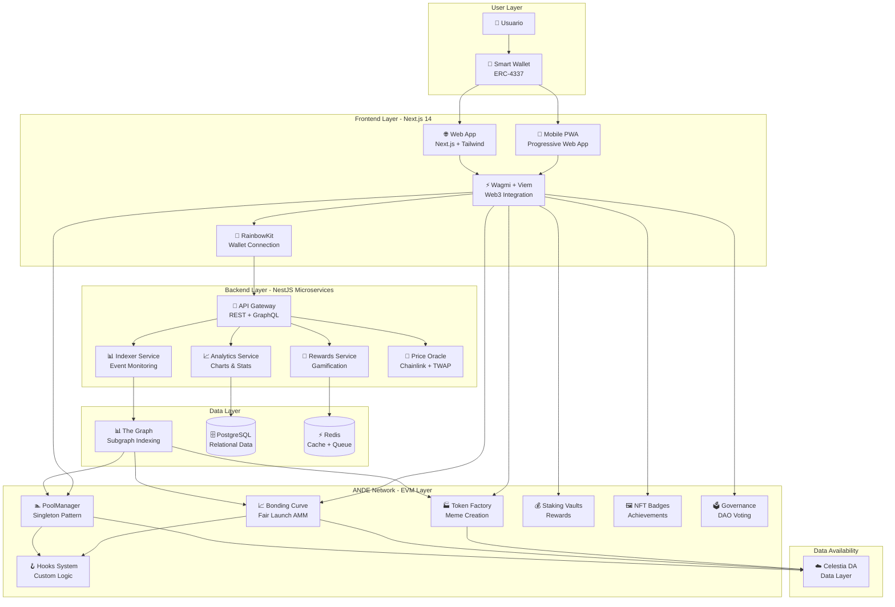

---

## 2. Flujo de Usuario: Creación de Meme Token

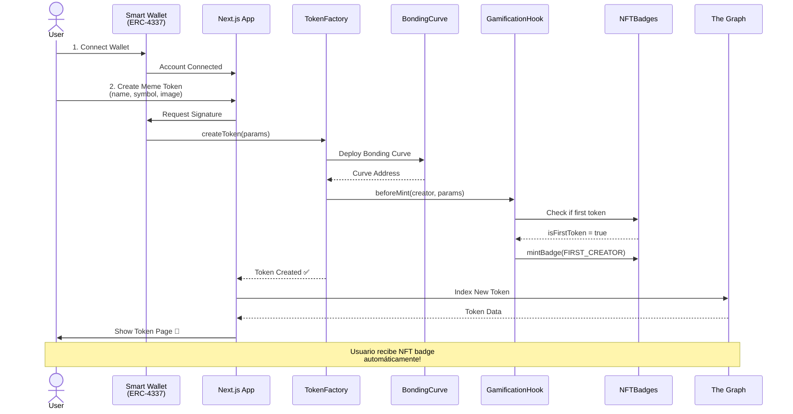

---

## 3. Flujo de Swap con Hooks Modulares

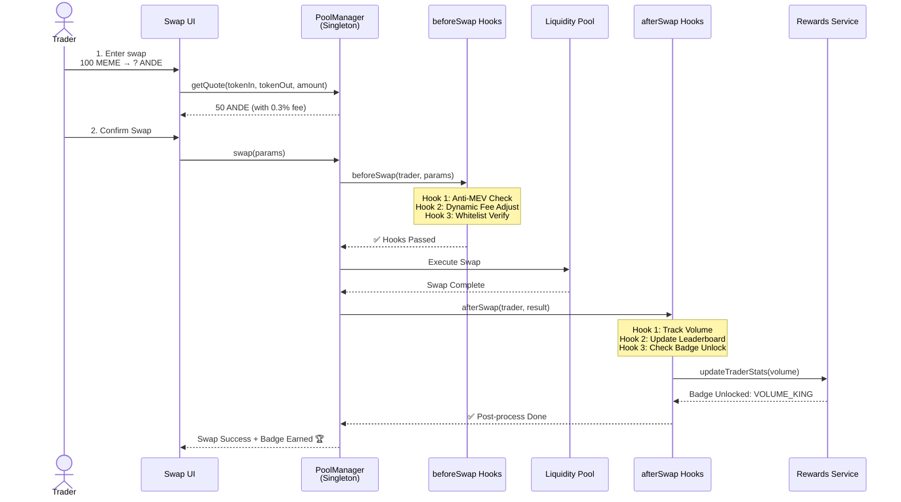

---

## 4. Arquitectura de Smart Contracts (Modular)

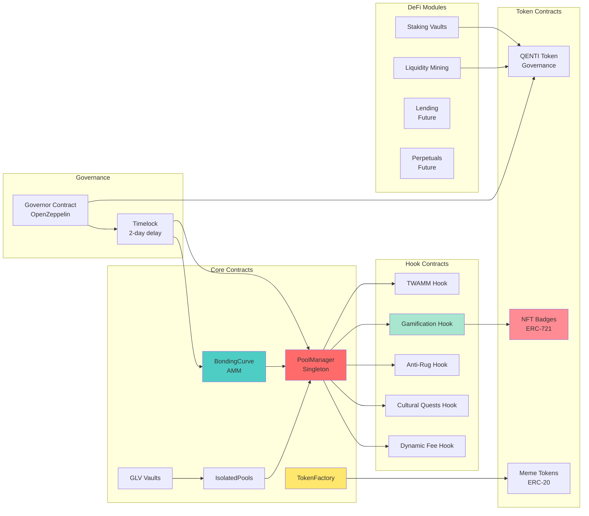

---

## 5. Sistema de Gamificación & Rewards

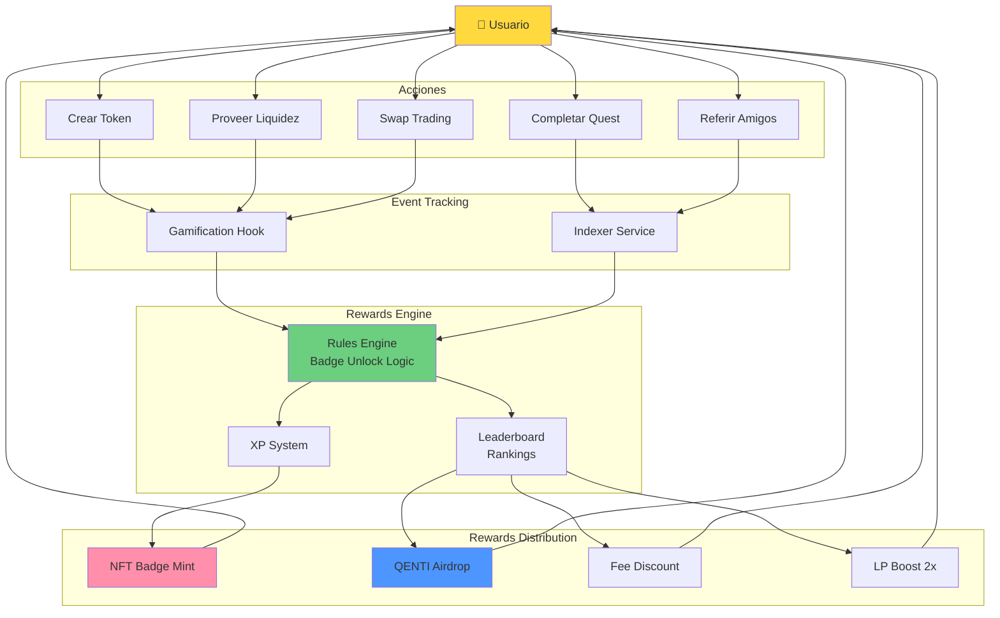

---

## 6. Bonding Curve Fair Launch Mechanism

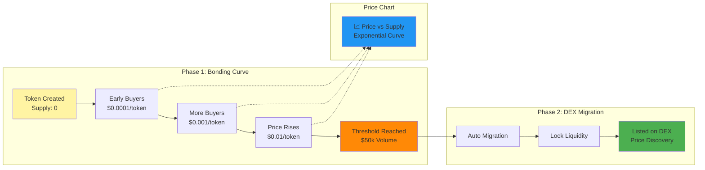

---

## 7. Multi-Layer Security Architecture

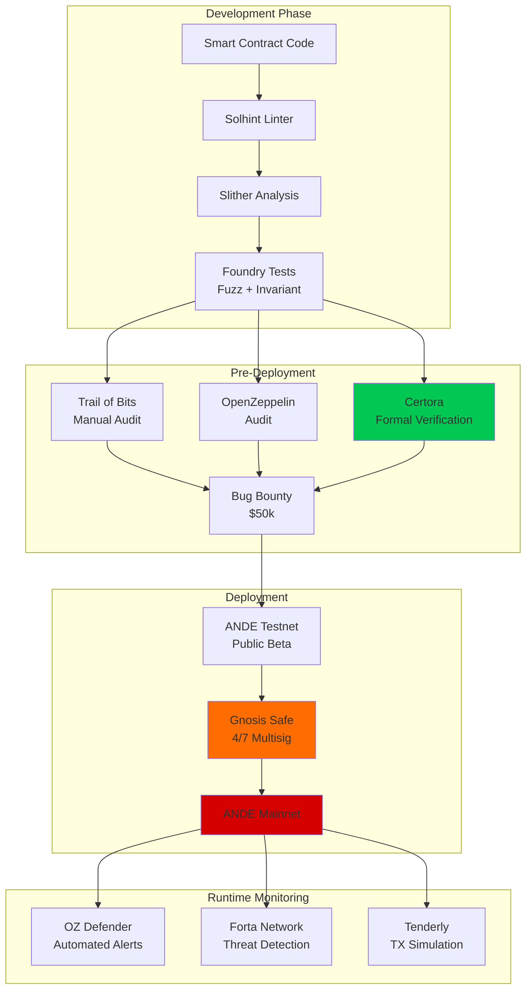

---

## 8. Monorepo Structure (Turborepo + pnpm)

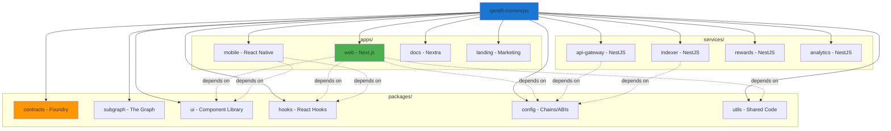

---

## 9. Data Flow: The Graph Indexing

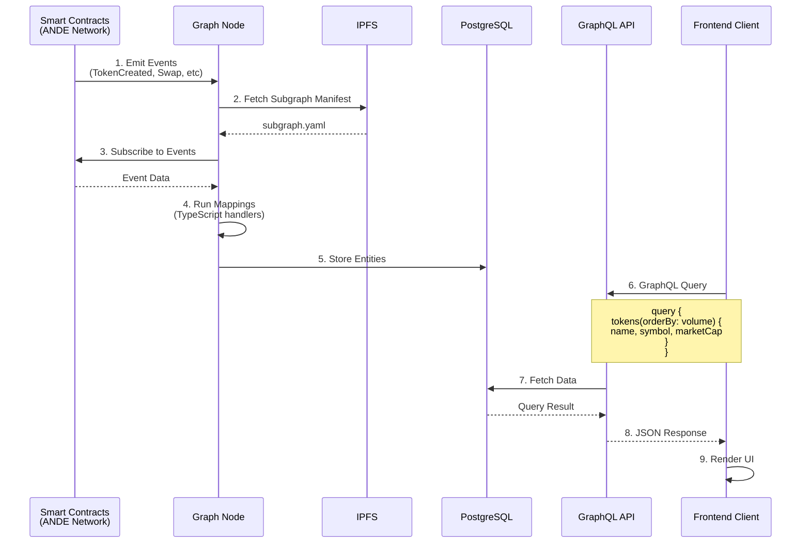

---

## 10. Cross-Chain Architecture (Future - Phase 3)

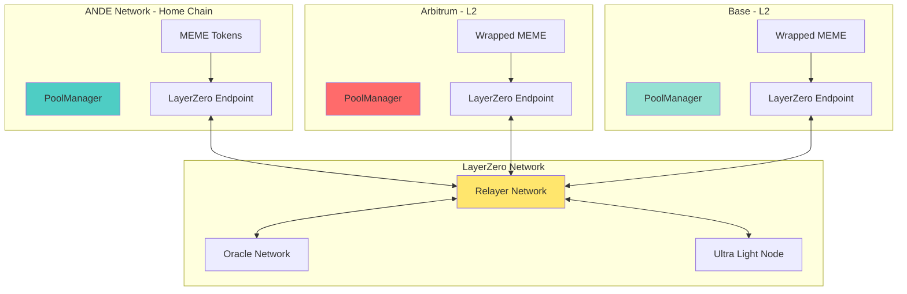

---

## 11. DAO Governance Flow

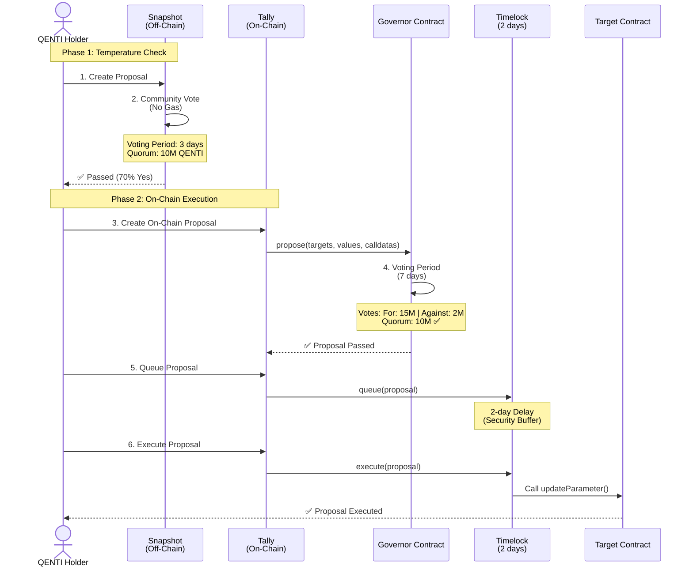

---

## 12. Account Abstraction (ERC-4337) Flow

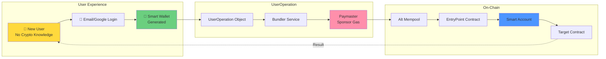

**Benefits:**
- ✅ No seed phrases
- ✅ Social recovery
- ✅ Gasless transactions
- ✅ Batch operations
- ✅ Session keys

---

## 13. Performance Optimization Strategy

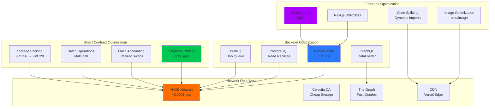

---

## 14. Testing Strategy Pyramid

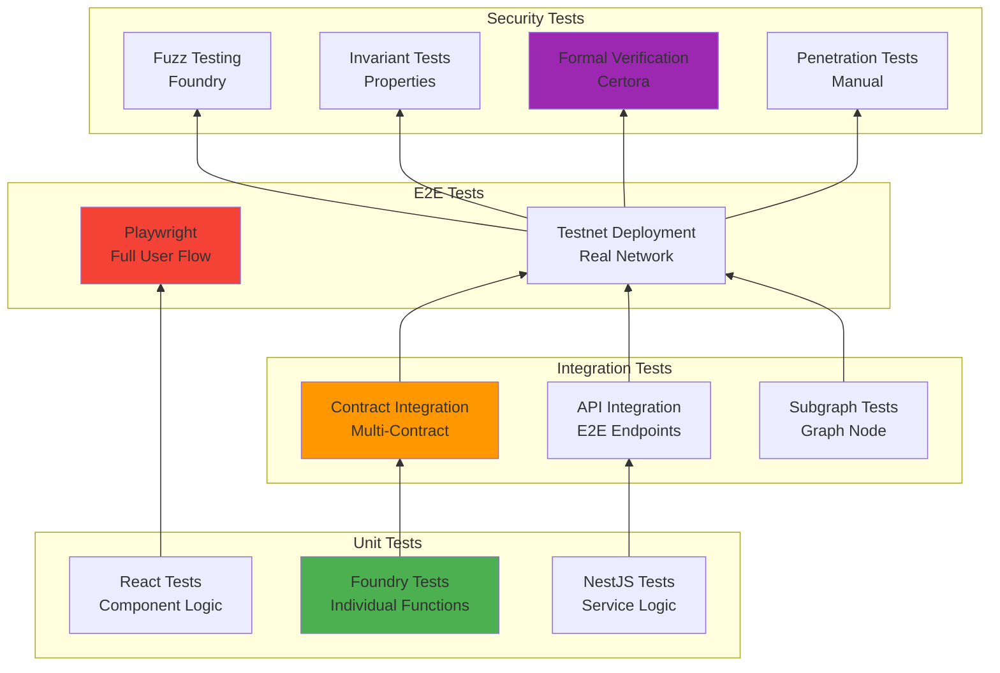

**Coverage Targets:**
- Unit Tests: **>95%**
- Integration Tests: **>85%**
- E2E Tests: **Critical Paths**
- Security: **100% Critical Functions**

---

## 15. Deployment Pipeline (CI/CD)

```mermaid
graph LR
    subgraph "Development"
        DEV[Developer Push]
        LINT[ESLint + Solhint]
        TEST[Run Tests]
    end

    subgraph "CI - GitHub Actions"
        BUILD[Build All Apps]
        COVERAGE[Test Coverage]
        SECURITY[Slither + Audit]
    end

    subgraph "Staging"
        TESTNET[Deploy Testnet]
        VERIFY[Verify Contracts]
        SMOKE[Smoke Tests]
    end

    subgraph "Production"
        REVIEW[Manual Review<br/>4/7 Multisig]
        MAINNET[Deploy Mainnet]
        MONITOR[Monitor Alerts]
    end

    DEV --> LINT
    LINT --> TEST
    TEST --> BUILD

    BUILD --> COVERAGE
    COVERAGE --> SECURITY

    SECURITY --> TESTNET
    TESTNET --> VERIFY
    VERIFY --> SMOKE

    SMOKE --> REVIEW
    REVIEW --> MAINNET
    MAINNET --> MONITOR

    style SECURITY fill:#ff5252
    style REVIEW fill:#ffab00
    style MAINNET fill:#00c853
```

---

**Diagramas preparados para QentiFi Architecture | 2024-2025**
